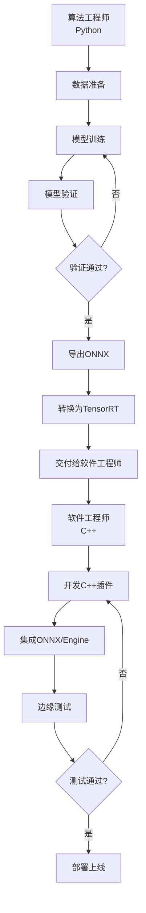

# 施工安全检测系统 - 完整实施方案

> **版本**: V1.0  
> **日期**: 2026-03-09  
> **负责部门**: 住建建筑  
> **实施周期**: 3.5个月（15种算法渐进式实现）  
> **目标**: 快速上线MVP验证价值，渐进式扩展到完整系统

---

## 📋 目录

1. [项目概述](#1-项目概述)
2. [实施计划](#2-实施计划)
3. [数据准备](#3-数据准备)
4. [模型训练](#4-模型训练)
5. [插件开发](#5-插件开发)
6. [测试验证](#6-测试验证)
7. [部署上线](#7-部署上线)
8. [资源与预算](#8-资源与预算)

---

## 1. 项目概述

### 1.1 业务需求

**住建建筑部门要求**：实现15种施工安全检测算法

| 优先级 | 算法 | 业务场景 | 部署位置 | 业务价值 |
|--------|------|----------|---------|---------|
| **P0** | 安全帽识别 | 人员安全 | 边缘 | ⭐⭐⭐⭐⭐ |
| **P0** | 反光衣识别 | 人员安全 | 边缘 | ⭐⭐⭐⭐⭐ |
| **P0** | 消防通道占用 | 安全监管 | 边缘 | ⭐⭐⭐⭐⭐ |
| **P1** | 安全带识别 | 高空作业 | 边缘 | ⭐⭐⭐⭐ |
| **P1** | 违规闯入 | 危险区域 | 边缘 | ⭐⭐⭐⭐ |
| **P1** | 脚手架安全 | 施工安全 | 边缘 | ⭐⭐⭐ |
| **P1** | 临边防护 | 安全防护 | 边缘 | ⭐⭐⭐ |
| **P2** | 裂缝检测 | 质量检测 | 边缘 | ⭐⭐⭐ |
| **P2** | 基坑监测 | 结构安全 | 云端 | ⭐⭐ |
| **P2** | 混凝土缺陷 | 质量检测 | 云端 | ⭐⭐ |
| **P2** | 钢筋检测 | 质量检测 | 云端 | ⭐⭐ |
| **P2** | 平整度检测 | 质量检测 | 云端 | ⭐ |
| **P2** | 施工进度 | 进度管理 | 云端 | ⭐⭐⭐ |
| **P2** | 塔吊检测 | 设备管理 | 边缘 | ⭐⭐ |
| **P2** | 材料堆放 | 现场管理 | 边缘 | ⭐⭐ |

**总计**：
- 边缘部署：9种
- 云端部署：6种
- 总预算：¥5-20万/工地/年

---

### 1.2 实施原则

```
核心原则：
1. MVP优先（2周上线5种核心算法）
2. 渐进式扩展（V1.0 → V2.0 → V3.0）
3. 复用现有能力（13类模型已训练完成）
4. 数据驱动扩展（有数据再加算法）
5. 客户反馈导向（基于真实需求调整）
```

---

### 1.3 技术选型

| 层次 | 技术选型 | 说明 |
|------|---------|------|
| **训练框架** | Ultralytics YOLOv8 | 统一训练框架 |
| **模型格式** | .pt + .onnx + .engine | 支持推理和转换 |
| **推理引擎** | TensorRT (边缘) | 高性能推理 |
| **插件框架** | edge_infer plugin system | 松耦合架构 |
| **边缘设备** | Jetson Orin NX 16GB | 边缘推理 |
| **云端API** | FastAPI + Docker | 云端服务 |

---

## 2. 实施计划

### 2.1 三阶段路线图

```
阶段1：MVP上线（Week 1-2）
  ├─ 5种算法快速上线
  ├─ 复用13类现有模型
  └─ 验证市场价值

阶段2：核心补充（Week 3-6）
  ├─ +5种算法扩展
  ├─ 采集新数据（消防通道、安全带等）
  └─ 增量训练V2.0模型

阶段3：完整实现（Week 7-14）
  ├─ +5种算法（专业检测）
  ├─ 采集专业数据
  └─ 云边协同部署
```

---

### 2.2 详细时间表

#### **阶段1：MVP上线（2周）**

| 周次 | 任务 | 负责人 | 输出 |
|------|------|--------|------|
| **Week 1** | | | |
| Day 1-2 | 部署13类模型到Jetson | 软件工程师 | edge_infer环境 |
| Day 3-4 | 开发construction_safety_v1插件 | 软件工程师 | 插件代码 |
| Day 5 | 开发API接口（/helmet, /vest, /intrusion） | 软件工程师 | FastAPI接口 |
| **Week 2** | | | |
| Day 1-2 | 前端界面开发 | 前端工程师 | Vue界面 |
| Day 3 | 集成测试 | 测试工程师 | 测试报告 |
| Day 4-5 | 客户部署MVP版本 | 产品工程师 | 现场部署 |

**MVP输出**：
- ✅ 5种算法上线
- ✅ 边缘推理<100ms
- ✅ 前端界面
- ✅ 客户现场部署

---

#### **阶段2：核心补充（4周）**

| 周次 | 任务 | 负责人 | 输出 |
|------|------|--------|------|
| **Week 3** | 消防通道数据采集（500张）| 产品工程师 | 数据集 |
| **Week 4** | 安全带+脚手架数据采集（800张）| 产品工程师 | 数据集 |
| **Week 5** | 数据标注+模型增量训练 | 算法工程师 | V2.0模型 |
| **Week 6** | V2.0插件开发+部署 | 软件工程师 | V2.0版本 |

**V2.0输出**：
- ✅ +5种算法（消防通道、安全带、脚手架、临边防护、裂缝）
- ✅ 18类模型
- ✅ 客户现场升级

---

#### **阶段3：完整实现（8周）**

| 周次 | 任务 | 负责人 | 输出 |
|------|------|--------|------|
| **Week 7-8** | 基坑监测+混凝土缺陷数据采集 | 产品工程师 | 数据集 |
| **Week 9-10** | 钢筋检测+平整度数据采集 | 产品工程师 | 数据集 |
| **Week 11-12** | 专业模型训练+云端服务开发 | 算法工程师 | 云端模型 |
| **Week 13-14** | 完整系统测试+部署 | 全员 | V3.0版本 |

**V3.0输出**：
- ✅ 15种算法全部实现
- ✅ 云边协同架构
- ✅ 完整系统上线

---

### 2.3 里程碑

| 里程碑 | 日期 | 交付物 | 验收标准 |
|--------|------|--------|---------|
| **M1: MVP上线** | Week 2 | 5种算法 | 推理<100ms，客户验收 |
| **M2: V2.0发布** | Week 6 | 10种算法 | mAP>0.85，客户验收 |
| **M3: 完整系统** | Week 14 | 15种算法 | 全部算法验收通过 |

---

## 3. 数据准备

### 3.1 现有数据盘点

**已有数据集**（可直接使用）：

| 数据集 | 数量 | 类别 | 来源 | 状态 |
|--------|------|------|------|------|
| **VisDrone** | 10,209张 | 9类（人、车等）| 公开 | ✅ |
| **安全帽数据集** | 5,000张 | 4类（戴/未戴/颜色）| 公开+自建 | ✅ |
| **反光衣数据集** | 3,000张 | 2类（穿/未穿）| 公开+自建 | ✅ |
| **人头数据集** | 2,000张 | 1类（人头）| 自建 | ✅ |
| **RCMT训练集** | 10,000张 | 变化检测 | LEVIR-CD | ✅ |

**总计**：30,209张，13类检测能力

---

### 3.2 数据采集计划

#### **Week 3: 消防通道占用（500张）**

**采集策略**：
```
采集对象：
- 被占用的消防通道（车辆、杂物、货物）
- 正常消防通道（对比数据）

采集方式：
1. 工地现场拍摄（300张）
   - 选择3-5个在建工地
   - 每个工地拍摄60-100张
   - 包含不同光照、角度
   
2. 网络爬虫（150张）
   - 新闻图片（安全事故报道）
   - 社交媒体（工地实拍）
   - 标注通道占用情况
   
3. 合成数据（50张）
   - Blender仿真（消防通道+车辆）
   - 渲染不同场景

标注规范：
- 检测框：标注消防通道区域
- 标签：fire_exit_blocked / fire_exit_clear
- 格式：YOLO格式（归一化坐标）

成本估算：
- 采集：3天 × ¥500/天 = ¥1,500
- 标注：500张 × ¥2/张 = ¥1,000
- 总计：¥2,500
```

**数据增强**：
```python
# 扩充到2,000张
augmentations = [
    RandomCrop(height=640, width=640),
    HorizontalFlip(p=0.5),
    RandomBrightnessContrast(p=0.3),
    Mosaic(p=0.5),
    MixUp(p=0.1)
]
```

---

#### **Week 4: 安全带识别（300张）**

**采集策略**：
```
采集对象：
- 高空作业人员（戴安全带）
- 高空作业人员（未戴安全带）

采集方式：
1. 建筑工地拍摄（200张）
   - 脚手架、塔吊等高空场景
   - 包含不同工种（焊工、架子工等）
   
2. 网络爬虫（80张）
   - 安全培训视频截图
   - 新闻报道图片
   
3. 合成数据（20张）
   - UE5仿真（高空场景+人物）

标注规范：
- 检测框：人员边界框 + 安全带区域
- 标签：safety_belt / no_safety_belt
- 关键点（可选）：安全带挂点

成本估算：
- 采集：2天 × ¥500/天 = ¥1,000
- 标注：300张 × ¥3/张 = ¥900（需标注关键点）
- 总计：¥1,900
```

---

#### **Week 4: 脚手架安全（500张）**

**采集策略**：
```
采集对象：
- 规范搭建的脚手架
- 违规搭建的脚手架（缺少连墙件、立杆间距过大等）

采集方式：
1. 工地巡检（350张）
   - 5个在建工地，每个70张
   - 包含不同类型脚手架（落地式、悬挑式等）
   
2. 专家标注（100张）
   - 安全工程师协助标注违规点
   
3. 网络爬虫（50张）
   - 事故案例图片

标注规范：
- 分割掩码：脚手架区域
- 标签：scaffolding_normal / scaffolding_hazard
- 属性标注：
  * 连墙件：有/无
  * 立杆间距：规范/过大
  * 脚手板：满铺/未满铺

成本估算：
- 采集：4天 × ¥500/天 = ¥2,000
- 标注：500张 × ¥4/张 = ¥2,000（需专家标注）
- 总计：¥4,000
```

---

#### **Week 4: 临边防护（300张）**

**采集策略**：
```
采集对象：
- 楼层临边、基坑临边、电梯井口
- 规范防护 vs 缺失防护

采集方式：
1. 工地实拍（250张）
2. 网络爬虫（50张）

标注规范：
- 检测框：临边防护栏杆
- 标签：edge_protection / no_edge_protection

成本：¥1,800
```

---

#### **Week 5: 裂缝检测（500张）**

**采集策略**：
```
公开数据集：
- SDNET2018: 56,000张（混凝土桥面、路面）
- CFD: 1,188张
- DeepCrack: 300张

迁移学习策略：
1. 在SDNET2018上预训练
2. 在建筑裂缝上微调（500张自建）
3. 部署到边缘

成本：
- 数据采集：¥1,000
- 标注：¥1,000
- 总计：¥2,000
```

---

### 3.3 数据管理

**数据存储结构**：
```
datasets/
├── construction_safety/
│   ├── raw/                      # 原始数据
│   │   ├── helmet/
│   │   ├── vest/
│   │   ├── fire_exit/
│   │   ├── safety_belt/
│   │   ├── scaffolding/
│   │   ├── edge_protection/
│   │   └── crack/
│   ├── processed/                # 处理后数据
│   │   ├── train/
│   │   │   ├── images/
│   │   │   └── labels/
│   │   ├── val/
│   │   └── test/
│   └── augmented/                # 增强数据
```

**数据版本控制**：
```bash
# 使用DVC管理数据集
dvc init
dvc add datasets/construction_safety/
dvc push  # 上传到云存储

# 数据版本记录
git tag v1.0-helmet
git tag v1.1-fire-exit
```

---

### 3.4 数据质量控制

**质量检查清单**：
```markdown
- [ ] 图像清晰度（分辨率>640×640）
- [ ] 标注完整性（无漏标、错标）
- [ ] 类别平衡（每类>300张）
- [ ] 场景多样性（不同工地、光照、角度）
- [ ] 数据增强（扩充3-5倍）
```

**自动检查脚本**：
```python
# scripts/check_dataset_quality.py

import os
import json
from pathlib import Path

def check_dataset_quality(dataset_dir):
    """数据集质量检查"""
    
    issues = []
    
    # 1. 检查图像数量
    train_images = Path(f"{dataset_dir}/train/images")
    if len(list(train_images.glob("*.jpg"))) < 1000:
        issues.append(f"训练集图像不足1000张")
    
    # 2. 检查类别平衡
    with open(f"{dataset_dir}/data.yaml") as f:
        config = yaml.safe_load(f)
    
    class_counts = {}
    for label_file in Path(f"{dataset_dir}/train/labels").glob("*.txt"):
        with open(label_file) as f:
            for line in f:
                class_id = int(line.split()[0])
                class_counts[class_id] = class_counts.get(class_id, 0) + 1
    
    max_count = max(class_counts.values())
    min_count = min(class_counts.values())
    if max_count / min_count > 5:
        issues.append(f"类别不平衡：最多{max_count}，最少{min_count}")
    
    # 3. 检查标注格式
    # ...
    
    return issues
```

---

## 4. 模型训练

### 4.1 模型演进路线

#### **V1.0模型（Week 1）- 13类**

```yaml
# config/construction_safety_v1.yaml

model:
  architecture: "yolov8m.pt"
  version: "1.0.0"
  
classes:
  # VisDrone 9类
  - person
  - bicycle
  - car
  - van
  - truck
  - tricycle
  - awning-tricycle
  - bus
  - motor
  
  # 施工安全 4类
  - helmet              # 戴安全帽
  - head                # 未戴安全帽的人头
  - reflective_vest     # 穿反光衣
  - no_vest             # 未穿反光衣

training:
  epochs: 100
  batch_size: 16
  img_size: 640
  device: 0
  optimizer: "AdamW"
  lr0: 0.01
  weight_decay: 0.0005
  
  augmentation:
    mosaic: 1.0
    mixup: 0.1
    hsv_h: 0.015
    hsv_s: 0.7
    hsv_v: 0.4
    degrees: 0.0
    translate: 0.1
    scale: 0.5
    shear: 0.0
    perspective: 0.0
    flipud: 0.0
    fliplr: 0.5

dataset:
  train: "datasets/construction_safety/processed/train/"
  val: "datasets/construction_safety/processed/val/"
  test: "datasets/construction_safety/processed/test/"
  
output:
  project: "models/construction_safety/v1.0"
  name: "yolov8m_13c"
```

**训练命令**：
```bash
# 训练V1.0模型
python scripts/train.py \
  --config config/construction_safety_v1.yaml \
  --resume false

# 导出ONNX
python scripts/export_onnx.py \
  --weights models/construction_safety/v1.0/yolov8m_13c/weights/best.pt \
  --imgsz 640 \
  --simplify

# 转换TensorRT
bash scripts/convert_tensorrt.sh \
  models/construction_safety/v1.0/weights/best.onnx \
  models/construction_safety/v1.0/weights/best.engine \
  fp16
```

---

#### **V2.0模型（Week 5）- 18类**

**增量训练策略**：
```python
# scripts/incremental_train.py

from ultralytics import YOLO

# 1. 加载V1.0模型
model = YOLO('models/construction_safety/v1.0/weights/best.pt')

# 2. 修改类别数（13 → 18）
model.model.nc = 18

# 3. 冻结backbone（前10层）
model.train(
    data='config/construction_safety_v2.yaml',
    epochs=50,
    freeze=10,  # 冻结前10层
    lr0=0.001,  # 较小学习率
    device=0
)
```

**新增类别**：
```yaml
# V2.0新增5类
classes:
  # V1.0 (13类)
  - ...
  
  # V2.0新增 (5类)
  - fire_exit_blocked       # 消防通道占用
  - safety_belt             # 安全带
  - scaffolding_hazard      # 脚手架安全隐患
  - edge_protection_missing # 临边防护缺失
  - crack                   # 裂缝
```

---

#### **V3.0模型（Week 11）- 23类 + 专业模型**

**边缘模型（23类）**：
```yaml
classes:
  # V1.0 (13类)
  - ...
  
  # V2.0 (5类)
  - ...
  
  # V3.0新增 (5类)
  - tower_crane          # 塔吊
  - material_pile        # 材料堆放
  - excavator            # 挖掘机
  - crane                # 起重机
  - concrete_mixer       # 混凝土搅拌机
```

**云端专业模型**：
```yaml
cloud_models:
  foundation_monitor:
    type: "segmentation"
    architecture: "SegFormer"
    classes: ["foundation_normal", "foundation_hazard"]
    
  concrete_defect:
    type: "detection"
    architecture: "YOLOv8"
    classes: ["honeycomb", "spalling", "crack"]
    
  rebar_detection:
    type: "detection"
    architecture: "YOLOv8"
    classes: ["rebar_exposed", "rebar_rust", "rebar_spacing"]
    
  flatness_check:
    type: "regression"
    architecture: "CNN"
    output: "flatness_score"
    
  progress_tracking:
    type: "tracking"
    architecture: "ByteTrack + RCMT"
    output: "progress_percentage"
```

---

### 4.2 训练流程

#### **4.2.1 数据准备**

```bash
# 1. 下载数据集
python scripts/download_datasets.py

# 2. 数据预处理
python scripts/prepare_data.py \
  --input datasets/construction_safety/raw/ \
  --output datasets/construction_safety/processed/ \
  --split 0.7 0.2 0.1  # train/val/test

# 3. 数据增强
python scripts/augment_data.py \
  --input datasets/construction_safety/processed/train/ \
  --output datasets/construction_safety/augmented/train/ \
  --methods mosaic,mixup,hsv \
  --multiplier 4
```

---

#### **4.2.2 模型训练**

```bash
# 1. 启动训练（支持断点续训）
python scripts/train.py \
  --config config/construction_safety_v1.yaml \
  --resume models/construction_safety/v1.0/yolov8m_13c/weights/last.pt

# 2. 监控训练（TensorBoard）
tensorboard --logdir models/construction_safety/v1.0/yolov8m_13c/

# 3. 模型验证
python scripts/validate.py \
  --weights models/construction_safety/v1.0/weights/best.pt \
  --data config/construction_safety_v1.yaml
```

**训练监控指标**：
```python
# 期望指标
metrics:
  mAP@0.5: ">0.85"
  mAP@0.5:0.95: ">0.65"
  precision: ">0.87"
  recall: ">0.85"
  f1: ">0.86"
  
  # 训练稳定性
  loss_variance: "<0.05"
  
  # 推理性能
  inference_time_ms: "<100"  # Jetson Orin NX
```

---

#### **4.2.3 模型转换**

```bash
# 1. 导出ONNX
python scripts/export_onnx.py \
  --weights models/construction_safety/v1.0/weights/best.pt \
  --imgsz 640 \
  --simplify \
  --opset 12

# 2. 验证ONNX
python -c "
import onnx
model = onnx.load('models/construction_safety/v1.0/weights/best.onnx')
onnx.checker.check_model(model)
print('✅ ONNX模型验证通过')
"

# 3. 转换TensorRT
bash scripts/convert_tensorrt.sh \
  models/construction_safety/v1.0/weights/best.onnx \
  models/construction_safety/v1.0/weights/best.engine \
  fp16

# 4. 测试TensorRT性能
python scripts/test_tensorrt_performance.py \
  --engine models/construction_safety/v1.0/weights/best.engine \
  --test_images datasets/construction_safety/processed/test/images/ \
  --runs 100
```

---

### 4.3 超参数调优

**自动超参搜索**：
```python
# scripts/hyperparameter_search.py

import optuna
from ultralytics import YOLO

def objective(trial):
    """Optuna目标函数"""
    
    # 搜索空间
    lr0 = trial.suggest_loguniform('lr0', 1e-4, 1e-2)
    weight_decay = trial.suggest_loguniform('weight_decay', 1e-6, 1e-3)
    momentum = trial.suggest_uniform('momentum', 0.9, 0.99)
    
    # 训练模型
    model = YOLO('yolov8m.pt')
    results = model.train(
        data='config/construction_safety_v1.yaml',
        epochs=50,
        lr0=lr0,
        weight_decay=weight_decay,
        momentum=momentum
    )
    
    # 返回验证集mAP
    return results['metrics/mAP@0.5']

# 启动搜索
study = optuna.create_study(direction='maximize')
study.optimize(objective, n_trials=50)

print(f"最佳超参数：{study.best_params}")
print(f"最佳mAP：{study.best_value}")
```

---

## 5. 开发架构

### 5.1 架构分工

**重要说明**：本系统采用**云边分离架构**，算法开发和插件开发分别在不同仓库进行。

```
┌─────────────────────────────────────────────────────────┐
│          edge_infer_cloud (云端/PC端 - Python)          │
├─────────────────────────────────────────────────────────┤
│  负责人：算法工程师                                      │
│  职责：数据准备、模型训练、验证、导出、云端API           │
│  语言：Python                                           │
│  目录：models/construction_safety/                      │
└─────────────────────────────────────────────────────────┘
                        ↓ 导出 ONNX/Engine
┌─────────────────────────────────────────────────────────┐
│          edge_infer (边缘端 - C++)                      │
├─────────────────────────────────────────────────────────┤
│  负责人：软件工程师                                      │
│  职责：插件开发、推理实现、边缘部署                      │
│  语言：C++                                              │
│  目录：src/plugins/construction_safety/                 │
└─────────────────────────────────────────────────────────┘
```

---

### 5.2 edge_infer_cloud 架构（算法工程师）

**目录结构**：

```
edge_infer_cloud/
├── models/
│   └── construction_safety/
│       ├── v1.0/
│       │   ├── weights/              # 模型权重
│       │   │   ├── best.pt           # PyTorch权重
│       │   │   ├── best.onnx         # ONNX格式
│       │   │   └── best.engine       # TensorRT引擎
│       │   ├── config/               # 配置文件
│       │   │   ├── model_config.json
│       │   │   ├── data.yaml
│       │   │   └── train_config.yaml
│       │   ├── scripts/              # Python训练脚本（算法工程师）
│       │   │   ├── train.py          # 训练脚本
│       │   │   ├── export_onnx.py    # 导出ONNX
│       │   │   ├── validate.py       # 模型验证
│       │   │   ├── test_performance.py  # 性能测试
│       │   │   └── inference_demo.py # 推理演示
│       │   ├── tests/                # Python测试脚本
│       │   │   ├── test_model.py
│       │   │   ├── test_accuracy.py
│       │   │   └── test_export.py
│       │   ├── docs/                 # 文档
│       │   │   ├── README.md
│       │   │   ├── MODEL_CARD.md
│       │   │   └── PERFORMANCE.md
│       │   └── test_results/         # 测试结果
│       └── README.md
├── backend/                          # 云端API（FastAPI）
│   └── api/routes/construction.py
└── datasets/                         # 数据集
    └── construction_safety/
```

---

### 5.3 edge_infer 架构（软件工程师）

**目录结构**（在 edge_infer 仓库中）：

```
edge_infer/
├── src/plugins/
│   └── construction_safety/          # C++ 插件（软件工程师）
│       ├── CMakeLists.txt            # 编译配置
│       ├── construction_safety.h     # C++ 头文件
│       ├── construction_safety.cpp   # C++ 主实现
│       ├── algorithms/               # 算法实现
│       │   ├── helmet_detection.cpp
│       │   ├── vest_detection.cpp
│       │   ├── intrusion_detection.cpp
│       │   ├── fire_exit_detection.cpp
│       │   └── safety_belt_detection.cpp
│       ├── utils/                    # 工具函数
│       │   ├── nms.cpp
│       │   └── postprocess.cpp
│       ├── config/
│       │   └── config.yaml           # 插件配置
│       └── README.md
└── build/
    └── plugins/
        └── libconstruction_safety.so # 编译后的插件
```

---

### 5.4 工作流程



---

### 5.5 算法工程师开发（Python）

**工作目录**: `edge_infer_cloud/models/construction_safety/v1.0/`

#### **5.5.1 训练脚本**

```python
# models/construction_safety/v1.0/scripts/train.py

#!/usr/bin/env python
# -*- coding: utf-8 -*-
"""
施工安全检测模型训练脚本
负责人：算法工程师
用途：在PC端/云端训练YOLOv8模型
"""

import os
import yaml
import json
from pathlib import Path
from ultralytics import YOLO
import torch

def train_construction_safety_model(config_path: str):
    """
    训练施工安全检测模型
    
    Args:
        config_path: 训练配置文件路径
    """
    # 1. 加载配置
    with open(config_path, 'r') as f:
        config = yaml.safe_load(f)
    
    print(f"{'='*60}")
    print(f"施工安全检测模型训练")
    print(f"{'='*60}")
    print(f"配置文件: {config_path}")
    print(f"模型架构: {config['model']['architecture']}")
    print(f"类别数: {len(config['classes'])}")
    print(f"训练轮数: {config['training']['epochs']}")
    print(f"批次大小: {config['training']['batch_size']}")
    print(f"{'='*60}\n")
    
    # 2. 加载预训练模型
    model = YOLO(config['model']['architecture'])
    
    # 3. 开始训练
    results = model.train(
        data=config['dataset']['train_config'],
        epochs=config['training']['epochs'],
        batch=config['training']['batch_size'],
        imgsz=config['training']['img_size'],
        device=config['training']['device'],
        
        # 优化器参数
        optimizer=config['training']['optimizer'],
        lr0=config['training']['lr0'],
        weight_decay=config['training']['weight_decay'],
        
        # 数据增强
        mosaic=config['augmentation']['mosaic'],
        mixup=config['augmentation']['mixup'],
        hsv_h=config['augmentation']['hsv_h'],
        hsv_s=config['augmentation']['hsv_s'],
        hsv_v=config['augmentation']['hsv_v'],
        
        # 输出路径
        project=config['output']['project'],
        name=config['output']['name'],
        
        # 其他参数
        patience=50,  # 早停耐心值
        save=True,
        save_period=10,  # 每10个epoch保存一次
        workers=8,
        verbose=True
    )
    
    # 4. 验证模型
    print(f"\n{'='*60}")
    print(f"模型验证")
    print(f"{'='*60}")
    
    metrics = model.val(
        data=config['dataset']['train_config'],
        split='val'
    )
    
    print(f"mAP@0.5: {metrics['metrics/mAP@0.5']:.4f}")
    print(f"mAP@0.5:0.95: {metrics['metrics/mAP@0.5:0.95']:.4f}")
    print(f"Precision: {metrics['metrics/precision']:.4f}")
    print(f"Recall: {metrics['metrics/recall']:.4f}")
    print(f"F1: {metrics['metrics/mAP@0.5']:.4f}")
    
    # 5. 保存训练结果
    results_path = Path(config['output']['project']) / config['output']['name']
    
    # 保存指标
    with open(results_path / 'metrics.json', 'w') as f:
        json.dump(metrics, f, indent=2)
    
    # 保存配置
    with open(results_path / 'train_config_used.yaml', 'w') as f:
        yaml.dump(config, f)
    
    print(f"\n✅ 训练完成")
    print(f"模型保存路径: {results_path / 'weights' / 'best.pt'}")
    print(f"{'='*60}\n")
    
    return results

if __name__ == "__main__":
    import argparse
    
    parser = argparse.ArgumentParser()
    parser.add_argument('--config', type=str, required=True, help='训练配置文件')
    args = parser.parse_args()
    
    train_construction_safety_model(args.config)
```

**使用方法**：
```bash
# 训练V1.0模型（13类）
python models/construction_safety/v1.0/scripts/train.py \
  --config models/construction_safety/v1.0/config/train_config.yaml
```

---

#### **5.5.2 模型导出脚本**

```python
# models/construction_safety/v1.0/scripts/export_onnx.py

#!/usr/bin/env python
# -*- coding: utf-8 -*-
"""
模型导出脚本：PyTorch → ONNX
负责人：算法工程师
用途：将训练好的PyTorch模型导出为ONNX格式，供软件工程师使用
"""

import os
import argparse
from pathlib import Path
from ultralytics import YOLO
import onnx
import onnxsim

def export_to_onnx(
    pt_path: str,
    output_dir: str,
    imgsz: int = 640,
    simplify: bool = True,
    opset: int = 12
):
    """
    导出PyTorch模型为ONNX格式
    
    Args:
        pt_path: PyTorch模型路径
        output_dir: 输出目录
        imgsz: 输入图像尺寸
        simplify: 是否简化ONNX模型
        opset: ONNX opset版本
    """
    print(f"\n{'='*60}")
    print(f"PT → ONNX 导出")
    print(f"{'='*60}\n")
    
    # 1. 加载模型
    print(f"✓ 加载模型: {pt_path}")
    model = YOLO(pt_path)
    
    # 2. 导出ONNX
    print(f"✓ 导出ONNX...")
    onnx_path = model.export(
        format='onnx',
        imgsz=imgsz,
        simplify=simplify,
        opset=opset,
        dynamic=False,  # 固定输入尺寸
        device='cpu'
    )
    
    print(f"✓ ONNX模型已导出: {onnx_path}")
    
    # 3. 验证ONNX
    print(f"\n✓ 验证ONNX模型...")
    onnx_model = onnx.load(onnx_path)
    onnx.checker.check_model(onnx_model)
    
    print(f"✓ ONNX模型验证通过")
    
    # 4. 打印信息
    print(f"\n{'='*60}")
    print(f"ONNX模型信息:")
    print(f"{'='*60}")
    print(f"  - 文件: {onnx_path}")
    print(f"  - 大小: {os.path.getsize(onnx_path) / (1024*1024):.2f} MB")
    print(f"  - Opset: {opset}")
    print(f"  - 输入: {onnx_model.graph.input[0].name}")
    print(f"  - 输出: {onnx_model.graph.output[0].name}")
    print(f"{'='*60}\n")
    
    # 5. 简化（可选）
    if simplify:
        try:
            print(f"✓ 简化ONNX模型...")
            onnx_model_simplified, check = onnxsim.simplify(onnx_model)
            
            simplified_path = str(onnx_path).replace('.onnx', '_simplified.onnx')
            onnx.save(onnx_model_simplified, simplified_path)
            
            print(f"✓ 简化后: {simplified_path}")
            print(f"  - 大小: {os.path.getsize(simplified_path) / (1024*1024):.2f} MB")
            
        except Exception as e:
            print(f"⚠️  简化失败: {e}")
    
    print(f"\n✅ ONNX导出完成")
    
    return onnx_path

if __name__ == "__main__":
    parser = argparse.ArgumentParser()
    parser.add_argument('--weights', type=str, required=True, help='PyTorch模型路径')
    parser.add_argument('--output', type=str, default='weights/', help='输出目录')
    parser.add_argument('--imgsz', type=int, default=640, help='输入图像尺寸')
    parser.add_argument('--simplify', action='store_true', help='简化ONNX模型')
    parser.add_argument('--opset', type=int, default=12, help='ONNX opset版本')
    args = parser.parse_args()
    
    export_to_onnx(
        pt_path=args.weights,
        output_dir=args.output,
        imgsz=args.imgsz,
        simplify=args.simplify,
        opset=args.opset
    )
```

**使用方法**：
```bash
# 导出ONNX
python models/construction_safety/v1.0/scripts/export_onnx.py \
  --weights models/construction_safety/v1.0/weights/best.pt \
  --output models/construction_safety/v1.0/weights/ \
  --imgsz 640 \
  --simplify
```

---

#### **5.5.3 模型验证脚本**

```python
# models/construction_safety/v1.0/scripts/validate.py

#!/usr/bin/env python
# -*- coding: utf-8 -*-
"""
模型验证脚本
负责人：算法工程师
用途：在PC端验证模型精度和性能
"""

import os
import json
import argparse
from pathlib import Path
from ultralytics import YOLO
import numpy as np
import time

def validate_model(
    weights_path: str,
    data_config: str,
    save_results: bool = True
):
    """
    验证模型精度和性能
    
    Args:
        weights_path: 模型权重路径
        data_config: 数据集配置文件
        save_results: 是否保存结果
    """
    print(f"\n{'='*60}")
    print(f"模型验证")
    print(f"{'='*60}\n")
    
    # 1. 加载模型
    print(f"✓ 加载模型: {weights_path}")
    model = YOLO(weights_path)
    
    # 2. 验证精度
    print(f"\n✓ 验证精度...")
    metrics = model.val(
        data=data_config,
        split='test',
        verbose=True
    )
    
    # 3. 打印指标
    print(f"\n{'='*60}")
    print(f"精度指标:")
    print(f"{'='*60}")
    print(f"  mAP@0.5: {metrics['metrics/mAP@0.5']:.4f}")
    print(f"  mAP@0.5:0.95: {metrics['metrics/mAP@0.5:0.95']:.4f}")
    print(f"  Precision: {metrics['metrics/precision']:.4f}")
    print(f"  Recall: {metrics['metrics/recall']:.4f}")
    print(f"  F1 Score: {2 * metrics['metrics/precision'] * metrics['metrics/recall'] / (metrics['metrics/precision'] + metrics['metrics/recall']):.4f}")
    
    # 4. 验证推理性能
    print(f"\n{'='*60}")
    print(f"性能测试:")
    print(f"{'='*60}")
    
    # 使用测试图像
    test_images = list(Path("datasets/construction_safety/processed/test/images").glob("*.jpg"))
    
    if len(test_images) > 0:
        inference_times = []
        
        for img_path in test_images[:100]:  # 测试100张
            start = time.perf_counter()
            results = model.predict(str(img_path), verbose=False)
            inference_time = (time.perf_counter() - start) * 1000
            inference_times.append(inference_time)
        
        print(f"  平均推理时间: {np.mean(inference_times):.2f} ms")
        print(f"  最小推理时间: {np.min(inference_times):.2f} ms")
        print(f"  最大推理时间: {np.max(inference_times):.2f} ms")
        print(f"  标准差: {np.std(inference_times):.2f} ms")
        print(f"  FPS: {1000 / np.mean(inference_times):.1f}")
    
    print(f"{'='*60}\n")
    
    # 5. 保存结果
    if save_results:
        results = {
            'model': weights_path,
            'metrics': {
                'mAP@0.5': float(metrics['metrics/mAP@0.5']),
                'mAP@0.5:0.95': float(metrics['metrics/mAP@0.5:0.95']),
                'precision': float(metrics['metrics/precision']),
                'recall': float(metrics['metrics/recall']),
            },
            'performance': {
                'avg_inference_time_ms': float(np.mean(inference_times)) if inference_times else None,
                'fps': float(1000 / np.mean(inference_times)) if inference_times else None,
            }
        }
        
        output_path = Path(weights_path).parent.parent / 'test_results' / 'validation_report.json'
        output_path.parent.mkdir(parents=True, exist_ok=True)
        
        with open(output_path, 'w') as f:
            json.dump(results, f, indent=2)
        
        print(f"✓ 结果已保存: {output_path}")
    
    # 6. 判断是否达标
    if metrics['metrics/mAP@0.5'] > 0.85:
        print(f"\n✅ 模型精度达标（mAP@0.5 > 0.85）")
        print(f"✅ 可以交付给软件工程师")
        return True
    else:
        print(f"\n❌ 模型精度不达标（mAP@0.5 < 0.85）")
        print(f"⚠️  需要重新训练或调优")
        return False

if __name__ == "__main__":
    parser = argparse.ArgumentParser()
    parser.add_argument('--weights', type=str, required=True, help='模型权重路径')
    parser.add_argument('--data', type=str, required=True, help='数据集配置文件')
    parser.add_argument('--save', action='store_true', help='保存结果')
    args = parser.parse_args()
    
    is_good = validate_model(
        weights_path=args.weights,
        data_config=args.data,
        save_results=args.save
    )
    
    exit(0 if is_good else 1)
```

**使用方法**：
```bash
# 验证模型
python models/construction_safety/v1.0/scripts/validate.py \
  --weights models/construction_safety/v1.0/weights/best.pt \
  --data models/construction_safety/v1.0/config/data.yaml \
  --save
```

---

#### **5.5.4 推理演示脚本**

```python
# models/construction_safety/v1.0/scripts/inference_demo.py

#!/usr/bin/env python
# -*- coding: utf-8 -*-
"""
推理演示脚本
负责人：算法工程师
用途：在PC端测试模型推理效果，验证算法逻辑
"""

import cv2
import numpy as np
from ultralytics import YOLO
import argparse

def inference_demo(model_path: str, image_path: str, output_path: str = None):
    """
    推理演示
    
    Args:
        model_path: 模型路径
        image_path: 输入图像路径
        output_path: 输出图像路径
    """
    # 1. 加载模型
    print(f"加载模型: {model_path}")
    model = YOLO(model_path)
    
    # 2. 读取图像
    image = cv2.imread(image_path)
    
    # 3. 推理
    results = model.predict(image, verbose=False)
    
    # 4. 可视化
    for result in results:
        # 绘制检测框
        for box in result.boxes:
            x1, y1, x2, y2 = box.xyxy[0].cpu().numpy().astype(int)
            confidence = box.conf[0].cpu().numpy()
            class_id = box.cls[0].cpu().numpy().astype(int)
            class_name = result.names[class_id]
            
            # 绘制边界框
            cv2.rectangle(image, (x1, y1), (x2, y2), (0, 255, 0), 2)
            
            # 绘制标签
            label = f"{class_name}: {confidence:.2f}"
            cv2.putText(image, label, (x1, y1 - 10),
                       cv2.FONT_HERSHEY_SIMPLEX, 0.5, (0, 255, 0), 2)
    
    # 5. 保存或显示
    if output_path:
        cv2.imwrite(output_path, image)
        print(f"✓ 结果已保存: {output_path}")
    else:
        cv2.imshow('Result', image)
        cv2.waitKey(0)
        cv2.destroyAllWindows()

if __name__ == "__main__":
    parser = argparse.ArgumentParser()
    parser.add_argument('--model', type=str, required=True, help='模型路径')
    parser.add_argument('--image', type=str, required=True, help='输入图像')
    parser.add_argument('--output', type=str, help='输出图像')
    args = parser.parse_args()
    
    inference_demo(args.model, args.image, args.output)
```

---

### 5.6 软件工程师开发（C++）

**工作目录**: `edge_infer/src/plugins/construction_safety/`（在 edge_infer 仓库中）

#### **5.6.1 CMakeLists.txt**

```cmake
# edge_infer/src/plugins/construction_safety/CMakeLists.txt

cmake_minimum_required(VERSION 3.10)
project(construction_safety_plugin)

# C++ 标准
set(CMAKE_CXX_STANDARD 14)
set(CMAKE_CXX_STANDARD_REQUIRED ON)

# 依赖
find_package(OpenCV REQUIRED)
find_package(CUDA REQUIRED)
find_package(TensorRT REQUIRED)

# 源文件
set(SOURCES
    construction_safety.cpp
    algorithms/helmet_detection.cpp
    algorithms/vest_detection.cpp
    algorithms/intrusion_detection.cpp
    utils/nms.cpp
    utils/postprocess.cpp
)

# 头文件
set(HEADERS
    construction_safety.h
    algorithms/helmet_detection.h
    algorithms/vest_detection.h
    algorithms/intrusion_detection.h
)

# 编译插件库
add_library(construction_safety SHARED ${SOURCES} ${HEADERS})

# 链接库
target_link_libraries(construction_safety
    ${OpenCV_LIBS}
    ${CUDA_LIBRARIES}
    ${TensorRT_LIBRARIES}
    framework_core  # edge_infer核心库
)

# 包含目录
target_include_directories(construction_safety
    PRIVATE
    ${OpenCV_INCLUDE_DIRS}
    ${CUDA_INCLUDE_DIRS}
    ${TensorRT_INCLUDE_DIRS}
    ${CMAKE_SOURCE_DIR}/src/core
    ${CMAKE_SOURCE_DIR}/src/common
)

# 安装
install(TARGETS construction_safety
    LIBRARY DESTINATION plugins
)
```

---

#### **5.6.2 C++ 插件头文件**

```cpp
// edge_infer/src/plugins/construction_safety/construction_safety.h

#ifndef CONSTRUCTION_SAFETY_H
#define CONSTRUCTION_SAFETY_H

#include "plugin/plugin_base.h"
#include "common.h"
#include <vector>
#include <string>
#include <unordered_map>

namespace framework {
namespace plugin {

/**
 * 施工安全检测插件
 * 支持13类检测：person, bicycle, car, van, truck, tricycle, 
 *              awning-tricycle, bus, motor, helmet, head, 
 *              reflective_vest, no_vest
 */
class ConstructionSafetyPlugin : public PluginBase {
public:
    ConstructionSafetyPlugin() = default;
    ~ConstructionSafetyPlugin() override = default;

    // 插件生命周期
    bool init(const std::string& plugin_config) override;
    bool execute(const void* input_data, void* output_data) override;
    void deinit() override;

    // 插件信息
    std::string get_plugin_name() const override { return "construction_safety"; }
    PluginType get_plugin_type() const override { return PluginType::DETECTION; }
    std::string get_plugin_version() const override { return "1.0.0"; }

    // 注入推理模块
    void SetInferModule(void* infer_mod) override {
        infer_mod_ = static_cast<framework::core::ModelInferModule*>(infer_mod);
    }

private:
    // 推理模块（由框架注入）
    framework::core::ModelInferModule* infer_mod_ = nullptr;

    // 配置参数
    float conf_threshold_ = 0.5f;
    float nms_threshold_ = 0.45f;
    std::vector<std::string> class_names_;
    
    // 类别索引
    int idx_helmet_ = -1;
    int idx_head_ = -1;
    int idx_vest_ = -1;
    int idx_no_vest_ = -1;
    int idx_person_ = -1;
    
    // 后处理方法
    std::vector<Detection> postprocess(
        const float* output,
        int num_detections,
        int num_classes
    );
    
    // NMS
    std::vector<int> nms(
        const std::vector<cv::Rect>& boxes,
        const std::vector<float>& scores,
        float nms_thresh
    );
};

} // namespace plugin
} // namespace framework

// 插件工厂导出
extern "C" framework::plugin::PluginBase* create_plugin();
extern "C" void destroy_plugin(framework::plugin::PluginBase* p);

#endif // CONSTRUCTION_SAFETY_H
```

---

#### **5.6.3 C++ 插件实现**

```cpp
// edge_infer/src/plugins/construction_safety/construction_safety.cpp

#include "construction_safety.h"
#include <fstream>
#include <opencv2/opencv.hpp>
#include <nlohmann/json.hpp>

namespace framework {
namespace plugin {

bool ConstructionSafetyPlugin::init(const std::string& plugin_config) {
    /**
     * 初始化插件
     * 1. 读取配置文件
     * 2. 加载类别信息
     * 3. 设置阈值参数
     */
    
    LOG(INFO) << "ConstructionSafetyPlugin initializing...";
    
    // 读取配置文件
    nlohmann::json config;
    std::ifstream config_file(plugin_config);
    config_file >> config;
    
    // 读取阈值
    if (config.contains("inference")) {
        conf_threshold_ = config["inference"]["confidence_threshold"].get<float>();
        nms_threshold_ = config["inference"]["nms_threshold"].get<float>();
    }
    
    // 读取类别信息
    if (config.contains("model") && config["model"].contains("classes")) {
        for (const auto& cls : config["model"]["classes"]) {
            class_names_.push_back(cls.get<std::string>());
        }
        
        // 建立类别索引
        for (int i = 0; i < class_names_.size(); i++) {
            if (class_names_[i] == "helmet") idx_helmet_ = i;
            else if (class_names_[i] == "head") idx_head_ = i;
            else if (class_names_[i] == "reflective_vest") idx_vest_ = i;
            else if (class_names_[i] == "no_vest") idx_no_vest_ = i;
            else if (class_names_[i] == "person") idx_person_ = i;
        }
    }
    
    LOG(INFO) << "ConstructionSafetyPlugin initialized successfully";
    LOG(INFO) << "  - Classes: " << class_names_.size();
    LOG(INFO) << "  - Confidence threshold: " << conf_threshold_;
    LOG(INFO) << "  - NMS threshold: " << nms_threshold_;
    
    return true;
}

bool ConstructionSafetyPlugin::execute(const void* input_data, void* output_data) {
    /**
     * 执行推理
     * 1. 获取输入图像
     * 2. 调用推理模块
     * 3. 后处理（NMS、过滤）
     * 4. 输出结果
     */
    
    // 输入数据转换
    const cv::Mat* input_image = static_cast<const cv::Mat*>(input_data);
    std::vector<Detection>* output_detections = static_cast<std::vector<Detection>*>(output_data);
    
    if (!infer_mod_) {
        LOG(ERROR) << "Inference module not initialized";
        return false;
    }
    
    // 调用推理模块
    InferenceResult infer_result;
    if (!infer_mod_->Infer(*input_image, infer_result)) {
        LOG(ERROR) << "Inference failed";
        return false;
    }
    
    // 后处理
    *output_detections = postprocess(
        infer_result.output_data,
        infer_result.num_detections,
        infer_result.num_classes
    );
    
    return true;
}

void ConstructionSafetyPlugin::deinit() {
    // 清理资源
    class_names_.clear();
    LOG(INFO) << "ConstructionSafetyPlugin deinitialized";
}

std::vector<Detection> ConstructionSafetyPlugin::postprocess(
    const float* output,
    int num_detections,
    int num_classes
) {
    /**
     * 后处理：NMS + 过滤
     * YOLOv8输出格式: [x, y, w, h, conf, cls1, cls2, ...]
     */
    
    std::vector<cv::Rect> boxes;
    std::vector<float> scores;
    std::vector<int> class_ids;
    
    // 解析输出
    for (int i = 0; i < num_detections; i++) {
        const float* det = output + i * (5 + num_classes);
        
        float confidence = det[4];
        if (confidence < conf_threshold_) continue;
        
        // 找到最大类别分数
        int class_id = 0;
        float max_class_score = 0;
        for (int c = 0; c < num_classes; c++) {
            if (det[5 + c] > max_class_score) {
                max_class_score = det[5 + c];
                class_id = c;
            }
        }
        
        // 坐标转换（center → corner）
        float cx = det[0];
        float cy = det[1];
        float w = det[2];
        float h = det[3];
        
        int x = static_cast<int>(cx - w / 2);
        int y = static_cast<int>(cy - h / 2);
        
        boxes.push_back(cv::Rect(x, y, static_cast<int>(w), static_cast<int>(h)));
        scores.push_back(confidence);
        class_ids.push_back(class_id);
    }
    
    // NMS
    std::vector<int> indices = nms(boxes, scores, nms_threshold_);
    
    // 构建输出
    std::vector<Detection> detections;
    for (int idx : indices) {
        Detection det;
        det.bbox = boxes[idx];
        det.confidence = scores[idx];
        det.class_id = class_ids[idx];
        det.class_name = class_names_[class_ids[idx]];
        detections.push_back(det);
    }
    
    return detections;
}

std::vector<int> ConstructionSafetyPlugin::nms(
    const std::vector<cv::Rect>& boxes,
    const std::vector<float>& scores,
    float nms_thresh
) {
    /**
     * 非极大值抑制（NMS）
     */
    
    std::vector<int> indices;
    std::vector<float> areas;
    
    // 计算面积
    for (const auto& box : boxes) {
        areas.push_back(box.width * box.height);
    }
    
    // 按分数排序
    std::vector<int> order(scores.size());
    std::iota(order.begin(), order.end(), 0);
    std::sort(order.begin(), order.end(), [&scores](int a, int b) {
        return scores[a] > scores[b];
    });
    
    // NMS
    std::vector<bool> suppressed(scores.size(), false);
    
    for (size_t i = 0; i < order.size(); i++) {
        int idx = order[i];
        
        if (suppressed[idx]) continue;
        
        indices.push_back(idx);
        
        for (size_t j = i + 1; j < order.size(); j++) {
            int idx_j = order[j];
            
            if (suppressed[idx_j]) continue;
            
            // 计算IoU
            int xx1 = std::max(boxes[idx].x, boxes[idx_j].x);
            int yy1 = std::max(boxes[idx].y, boxes[idx_j].y);
            int xx2 = std::min(boxes[idx].x + boxes[idx].width, 
                              boxes[idx_j].x + boxes[idx_j].width);
            int yy2 = std::min(boxes[idx].y + boxes[idx].height,
                              boxes[idx_j].y + boxes[idx_j].height);
            
            int w = std::max(0, xx2 - xx1);
            int h = std::max(0, yy2 - yy1);
            float inter = w * h;
            float iou = inter / (areas[idx] + areas[idx_j] - inter);
            
            if (iou > nms_thresh) {
                suppressed[idx_j] = true;
            }
        }
    }
    
    return indices;
}

} // namespace plugin
} // namespace framework

// 插件工厂函数
extern "C" framework::plugin::PluginBase* create_plugin() {
    return new framework::plugin::ConstructionSafetyPlugin();
}

extern "C" void destroy_plugin(framework::plugin::PluginBase* p) {
    delete p;
}
```

---

#### **5.6.4 编译脚本**

```bash
#!/bin/bash
# edge_infer/scripts/build_construction_safety.sh

set -e

# 编译construction_safety插件
mkdir -p build/plugins/construction_safety
cd build/plugins/construction_safety

cmake ../../src/plugins/construction_safety \
    -DCMAKE_BUILD_TYPE=Release \
    -DTensorRT_ROOT=/usr/local/TensorRT \
    -DCUDA_TOOLKIT_ROOT_DIR=/usr/local/cuda

make -j$(nproc)

# 安装到edge_infer/plugins/
cp libconstruction_safety.so ../../../edge_infer/plugins/

echo "✓ construction_safety插件编译完成"
echo "✓ 插件位置: edge_infer/plugins/libconstruction_safety.so"
```
        
        # 预处理
        input_tensor = self.preprocess(image)
        
        # 推理
        start = time.perf_counter()
        outputs = self.infer(input_tensor)
        inference_time = (time.perf_counter() - start) * 1000
        
        # 后处理
        detections = self.postprocess(outputs)
        
        return {
            'detections': detections,
            'inference_time_ms': inference_time
        }
    
    def run_algorithm(self, algorithm_name: str, image: np.ndarray, **kwargs):
        """
        运行指定算法
        
        Args:
            algorithm_name: 算法名称
            image: 输入图像
            **kwargs: 算法参数
        
        Returns:
            算法结果
        """
        if algorithm_name not in self.algorithms:
            raise ValueError(f"算法 {algorithm_name} 不存在")
        
        # 先检测所有目标
        detections = self.detect(image)
        
        # 运行算法逻辑
        algorithm = self.algorithms[algorithm_name]
        result = algorithm.run(detections['detections'], image, **kwargs)
        
        return result
    
    def preprocess(self, image: np.ndarray) -> np.ndarray:
        """图像预处理"""
        # resize
        h, w = 640, 640
        image = cv2.resize(image, (w, h))
        
        # BGR → RGB
        image = cv2.cvtColor(image, cv2.COLOR_BGR2RGB)
        
        # normalize
        image = image.astype(np.float32) / 255.0
        
        # HWC → CHW
        image = np.transpose(image, (2, 0, 1))
        
        # batch
        image = np.expand_dims(image, axis=0)
        
        # contiguous
        image = np.ascontiguousarray(image, dtype=np.float32)
        
        return image
    
    def infer(self, input_tensor: np.ndarray) -> np.ndarray:
        """TensorRT推理"""
        # 分配GPU内存
        input_size = input_tensor.nbytes
        output_size = np.prod(self.output_shape) * 4  # float32
        
        d_input = cuda.mem_alloc(input_size)
        d_output = cuda.mem_alloc(output_size)
        
        bindings = [int(d_input), int(d_output)]
        
        # 拷贝输入数据到GPU
        cuda.memcpy_htod(d_input, input_tensor)
        
        # 执行推理
        self.context.execute_v2(bindings)
        
        # 拷贝输出数据到CPU
        output = np.empty(self.output_shape, dtype=np.float32)
        cuda.memcpy_dtoh(output, d_output)
        
        return output
    
    def postprocess(self, outputs: np.ndarray) -> List[Dict]:
        """后处理（NMS + 过滤）"""
        detections = []
        
        # YOLOv8输出格式: [batch, num_detections, 5+num_classes]
        num_detections = outputs.shape[1]
        
        for i in range(num_detections):
            detection = outputs[0, i, :]
            
            # 提取边界框
            cx, cy, w, h = detection[:4]
            
            # 转换为corner格式
            x1 = cx - w / 2
            y1 = cy - h / 2
            x2 = cx + w / 2
            y2 = cy + h / 2
            
            # 提取类别
            class_scores = detection[4:]
            class_id = np.argmax(class_scores)
            confidence = class_scores[class_id]
            
            # 过滤低置信度
            if confidence < self.config['confidence_threshold']:
                continue
            
            detections.append({
                'class': self.classes[class_id],
                'confidence': float(confidence),
                'bbox': [float(x1), float(y1), float(x2), float(y2)]
            })
        
        # NMS（按类别）
        detections = self.nms_by_class(detections)
        
        return detections
    
    def nms_by_class(self, detections: List[Dict]) -> List[Dict]:
        """按类别进行NMS"""
        # 实现略...
        return detections
```

---

#### **5.2.2 安全帽检测算法**

```python
# edge_infer/plugins/construction_safety/algorithms/helmet_detection.py

from typing import Dict, List

class HelmetDetectionAlgorithm:
    """安全帽检测算法"""
    
    def __init__(self, config: dict):
        self.config = config
    
    def run(self, detections: List[Dict], image, **kwargs) -> Dict:
        """
        运行安全帽检测
        
        Args:
            detections: YOLOv8检测结果
            image: 原始图像（用于可视化）
        
        Returns:
            {
                'total': int,           # 总人数
                'with_helmet': int,     # 戴安全帽数量
                'without_helmet': int,  # 未戴安全帽数量
                'compliance_rate': float,  # 佩戴率
                'violations': List[Dict]   # 违规人员
            }
        """
        # 筛选相关类别
        helmets = [d for d in detections if d['class'] == 'helmet']
        heads = [d for d in detections if d['class'] == 'head']
        
        total = len(helmets) + len(heads)
        compliance_rate = len(helmets) / total if total > 0 else 0
        
        # 生成违规列表
        violations = []
        for head in heads:
            violations.append({
                'type': 'no_helmet',
                'confidence': head['confidence'],
                'bbox': head['bbox']
            })
        
        return {
            'total': total,
            'with_helmet': len(helmets),
            'without_helmet': len(heads),
            'compliance_rate': compliance_rate,
            'violations': violations
        }
```

---

#### **5.2.3 违规闯入检测算法**

```python
# edge_infer/plugins/construction_safety/algorithms/intrusion_detection.py

from typing import Dict, List
from shapely.geometry import Point, Polygon

class IntrusionDetectionAlgorithm:
    """违规闯入检测算法"""
    
    def __init__(self, config: dict):
        self.config = config
    
    def run(
        self, 
        detections: List[Dict], 
        image, 
        danger_zones: List[Dict] = None,
        **kwargs
    ) -> Dict:
        """
        运行违规闯入检测
        
        Args:
            detections: YOLOv8检测结果
            image: 原始图像
            danger_zones: 危险区域列表
                [
                    {
                        'name': 'zone1',
                        'points': [[x1,y1], [x2,y2], ...]
                    },
                    ...
                ]
        
        Returns:
            {
                'intrusion_count': int,
                'intrusions': List[Dict],
                'alert': bool
            }
        """
        if danger_zones is None:
            danger_zones = self.config.get('danger_zones', [])
        
        # 筛选person类别
        persons = [d for d in detections if d['class'] == 'person']
        
        # 判断闯入
        intrusions = []
        for person in persons:
            # 计算person中心点
            bbox = person['bbox']
            center_x = (bbox[0] + bbox[2]) / 2
            center_y = (bbox[1] + bbox[3]) / 2
            point = Point(center_x, center_y)
            
            # 检查是否在危险区域内
            for zone in danger_zones:
                polygon = Polygon(zone['points'])
                
                if polygon.contains(point):
                    intrusions.append({
                        'person': person,
                        'zone': zone['name'],
                        'location': [center_x, center_y],
                        'confidence': person['confidence']
                    })
        
        return {
            'intrusion_count': len(intrusions),
            'intrusions': intrusions,
            'alert': len(intrusions) > 0
        }
```

---

### 5.3 插件配置

```yaml
# edge_infer/plugins/construction_safety/config.yaml

plugin:
  name: "construction_safety"
  version: "1.0.0"
  description: "施工安全检测插件（13类检测）"

model:
  path: "models/construction_safety/v1.0/weights/best.engine"
  type: "tensorrt"
  precision: "fp16"
  classes:
    - person
    - bicycle
    - car
    - van
    - truck
    - tricycle
    - awning-tricycle
    - bus
    - motor
    - helmet
    - head
    - reflective_vest
    - no_vest

inference:
  device: "cuda:0"
  batch_size: 1
  confidence_threshold: 0.5
  nms_threshold: 0.45
  max_detections: 100

algorithms:
  - name: "helmet_detection"
    type: "composite"
    description: "安全帽识别"
    classes: ["helmet", "head"]
    
  - name: "vest_detection"
    type: "composite"
    description: "反光衣识别"
    classes: ["reflective_vest", "no_vest"]
    
  - name: "intrusion_detection"
    type: "composite"
    description: "违规闯入检测"
    classes: ["person"]
    config:
      danger_zones:
        - name: "zone1"
          points: [[100, 100], [200, 100], [200, 200], [100, 200]]
        - name: "zone2"
          points: [[300, 300], [400, 300], [400, 400], [300, 400]]

deployment:
  target: "edge"
  device: "jetson_orin_nx"
  memory_footprint_mb: 400
  inference_time_target_ms: 100

output:
  format: "json"
  save_results: true
  output_dir: "logs/construction_safety/"
  visualizations: true
```

---

## 6. 测试验证

### 6.1 单元测试

```python
# tests/unit/test_construction_safety_detector.py

import pytest
import numpy as np
from edge_infer.plugins.construction_safety.detector import ConstructionSafetyDetector

class TestConstructionSafetyDetector:
    
    @pytest.fixture
    def detector(self):
        """初始化检测器"""
        config = {
            'model_path': 'models/construction_safety/v1.0/weights/best.engine',
            'classes': ['person', 'helmet', 'head', 'reflective_vest', 'no_vest'],
            'confidence_threshold': 0.5,
            'nms_threshold': 0.45
        }
        return ConstructionSafetyDetector(config)
    
    def test_helmet_detection(self, detector):
        """测试安全帽检测"""
        # 加载测试图像
        image = cv2.imread('tests/test_images/construction_site_01.jpg')
        
        # 运行算法
        result = detector.run_algorithm('helmet_detection', image)
        
        # 验证结果
        assert 'total' in result
        assert 'with_helmet' in result
        assert 'without_helmet' in result
        assert result['total'] == result['with_helmet'] + result['without_helmet']
        assert 0 <= result['compliance_rate'] <= 1
    
    def test_intrusion_detection(self, detector):
        """测试违规闯入检测"""
        image = cv2.imread('tests/test_images/danger_zone_01.jpg')
        
        danger_zones = [
            {
                'name': 'test_zone',
                'points': [[100, 100], [200, 100], [200, 200], [100, 200]]
            }
        ]
        
        result = detector.run_algorithm(
            'intrusion_detection', 
            image, 
            danger_zones=danger_zones
        )
        
        assert 'intrusion_count' in result
        assert 'intrusions' in result
        assert 'alert' in result
    
    def test_inference_time(self, detector):
        """测试推理时间"""
        image = cv2.imread('tests/test_images/construction_site_01.jpg')
        
        # 运行10次推理
        times = []
        for _ in range(10):
            result = detector.detect(image)
            times.append(result['inference_time_ms'])
        
        avg_time = np.mean(times)
        assert avg_time < 100, f"推理时间过长: {avg_time}ms"
```

---

### 6.2 集成测试

```python
# tests/integration/test_construction_safety_integration.py

import pytest
import requests
import json

class TestConstructionSafetyIntegration:
    
    def test_helmet_api(self):
        """测试安全帽检测API"""
        # 上传图像
        files = {'image': open('tests/test_images/construction_site_01.jpg', 'rb')}
        response = requests.post(
            'http://localhost:8081/api/construction/helmet',
            files=files
        )
        
        assert response.status_code == 200
        
        data = response.json()
        assert 'total' in data
        assert 'with_helmet' in data
        assert 'compliance_rate' in data
    
    def test_intrusion_api(self):
        """测试违规闯入API"""
        # 准备数据
        payload = {
            'device_id': 'test_device_001',
            'image': 'tests/test_images/danger_zone_01.jpg',
            'danger_zones': [
                {
                    'name': 'zone1',
                    'points': [[100, 100], [200, 100], [200, 200], [100, 200]]
                }
            ]
        }
        
        response = requests.post(
            'http://localhost:8081/api/construction/intrusion',
            json=payload
        )
        
        assert response.status_code == 200
        
        data = response.json()
        assert 'intrusion_count' in data
        assert 'alert' in data
    
    def test_end_to_end(self):
        """端到端测试"""
        # 1. 上传图像
        # 2. 调用检测API
        # 3. 获取结果
        # 4. 验证结果
        pass
```

---

### 6.3 性能测试

```python
# tests/performance/test_inference_performance.py

import pytest
import time
import numpy as np
from edge_infer.plugins.construction_safety.detector import ConstructionSafetyDetector

class TestInferencePerformance:
    
    def test_throughput(self):
        """测试吞吐量"""
        detector = ConstructionSafetyDetector(config)
        image = cv2.imread('tests/test_images/construction_site_01.jpg')
        
        # 预热
        for _ in range(10):
            detector.detect(image)
        
        # 正式测试
        start = time.time()
        num_runs = 100
        
        for _ in range(num_runs):
            detector.detect(image)
        
        elapsed = time.time() - start
        fps = num_runs / elapsed
        
        print(f"FPS: {fps:.1f}")
        assert fps > 10, f"FPS过低: {fps}"
    
    def test_latency(self):
        """测试延迟"""
        detector = ConstructionSafetyDetector(config)
        image = cv2.imread('tests/test_images/construction_site_01.jpg')
        
        # 测试100次
        latencies = []
        for _ in range(100):
            start = time.perf_counter()
            detector.detect(image)
            latency = (time.perf_counter() - start) * 1000  # ms
            latencies.append(latency)
        
        # 统计
        avg_latency = np.mean(latencies)
        p95_latency = np.percentile(latencies, 95)
        p99_latency = np.percentile(latencies, 99)
        
        print(f"平均延迟: {avg_latency:.2f}ms")
        print(f"P95延迟: {p95_latency:.2f}ms")
        print(f"P99延迟: {p99_latency:.2f}ms")
        
        assert avg_latency < 100, f"平均延迟过高: {avg_latency}ms"
```

---

### 6.4 模型精度测试

```python
# tests/accuracy/test_model_accuracy.py

from ultralytics import YOLO
import json

class TestModelAccuracy:
    
    def test_map_score(self):
        """测试mAP分数"""
        model = YOLO('models/construction_safety/v1.0/weights/best.pt')
        
        # 在测试集上验证
        results = model.val(
            data='config/construction_safety_v1.yaml',
            split='test'
        )
        
        # 验证指标
        assert results['metrics/mAP@0.5'] > 0.85, f"mAP@0.5过低: {results['metrics/mAP@0.5']}"
        assert results['metrics/mAP@0.5:0.95'] > 0.65
        
        # 保存结果
        with open('tests/results/accuracy_report.json', 'w') as f:
            json.dump(results, f, indent=2)
    
    def test_class_accuracy(self):
        """测试每个类别的精度"""
        model = YOLO('models/construction_safety/v1.0/weights/best.pt')
        
        results = model.val(data='config/construction_safety_v1.yaml')
        
        # 检查每个类别
        for class_name, metrics in results['metrics'].items():
            assert metrics['precision'] > 0.80, f"{class_name} precision过低"
            assert metrics['recall'] > 0.80, f"{class_name} recall过低"
```

---

## 7. 部署上线

### 7.1 边缘设备部署

#### **7.1.1 Jetson Orin NX部署**

**部署脚本**：
```bash
#!/bin/bash
# deployment/jetson/deploy_construction_safety.sh

set -e

# 1. 环境准备
echo "✓ 准备Jetson环境..."
sudo apt-get update
sudo apt-get install -y python3-pip libopencv-dev

# 2. 安装依赖
echo "✓ 安装Python依赖..."
pip3 install -r requirements_jetson.txt

# 3. 复制模型文件
echo "✓ 复制模型文件..."
scp models/construction_safety/v1.0/weights/best.engine \
    jetson@192.168.1.100:/opt/edge_infer/models/

# 4. 复制插件代码
echo "✓ 复制插件代码..."
scp -r edge_infer/plugins/construction_safety \
    jetson@192.168.1.100:/opt/edge_infer/plugins/

# 5. 配置服务
echo "✓ 配置systemd服务..."
sudo cp deployment/jetson/edge_infer.service /etc/systemd/system/
sudo systemctl daemon-reload
sudo systemctl enable edge_infer
sudo systemctl start edge_infer

# 6. 验证部署
echo "✓ 验证部署..."
sleep 5
curl http://localhost:8080/health

echo "✅ 施工安全检测部署完成"
```

**systemd服务**：
```ini
# /etc/systemd/system/edge_infer.service

[Unit]
Description=Edge Infer Construction Safety Detection Service
After=network.target

[Service]
Type=simple
User=jetson
WorkingDirectory=/opt/edge_infer
ExecStart=/usr/bin/python3 /opt/edge_infer/main.py --plugin construction_safety
Restart=always
RestartSec=10

[Install]
WantedBy=multi-user.target
```

---

#### **7.1.2 性能优化**

**TensorRT优化**：
```bash
# 1. FP16精度
trtexec \
  --onnx=models/construction_safety/v1.0/weights/best.onnx \
  --saveEngine=models/construction_safety/v1.0/weights/best_fp16.engine \
  --fp16 \
  --workspace=4096

# 2. INT8量化（需要校准）
trtexec \
  --onnx=models/construction_safety/v1.0/weights/best.onnx \
  --saveEngine=models/construction_safety/v1.0/weights/best_int8.engine \
  --int8 \
  --calib=calibration_cache.txt

# 3. 性能对比
python scripts/compare_precision.py \
  --engine_fp16 models/construction_safety/v1.0/weights/best_fp16.engine \
  --engine_int8 models/construction_safety/v1.0/weights/best_int8.engine
```

---

### 7.2 云端API部署

#### **7.2.1 Docker部署**

**Dockerfile**：
```dockerfile
# backend/Dockerfile.construction

FROM python:3.10-slim

WORKDIR /app

# 安装依赖
COPY requirements.txt .
RUN pip install --no-cache-dir -r requirements.txt

# 复制代码
COPY backend/ ./backend/
COPY edge_infer/plugins/construction_safety ./plugins/construction_safety

# 暴露端口
EXPOSE 8081

# 启动服务
CMD ["uvicorn", "backend.main:app", "--host", "0.0.0.0", "--port", "8081"]
```

**docker-compose.yml**：
```yaml
# deployment/docker/docker-compose.yml

version: '3.8'

services:
  construction-api:
    build:
      context: .
      dockerfile: Dockerfile.construction
    container_name: construction_safety_api
    ports:
      - "8081:8081"
    environment:
      - MODEL_PATH=/app/models/construction_safety/v1.0/weights/best.engine
      - DEVICE=cuda:0
    volumes:
      - ./models:/app/models
      - ./logs:/app/logs
    depends_on:
      - postgres
      - redis
    networks:
      - edge-cloud-network
    restart: always
    deploy:
      resources:
        reservations:
          devices:
            - driver: nvidia
              count: 1
              capabilities: [gpu]
```

**部署命令**：
```bash
# 构建镜像
docker-compose build construction-api

# 启动服务
docker-compose up -d construction-api

# 查看日志
docker logs -f construction_safety_api

# 测试API
curl http://localhost:8081/health
```

---

#### **7.2.2 Kubernetes部署**

**deployment.yaml**：
```yaml
# deployment/k8s/construction-api-deployment.yaml

apiVersion: apps/v1
kind: Deployment
metadata:
  name: construction-safety-api
  namespace: edge-cloud
spec:
  replicas: 3
  selector:
    matchLabels:
      app: construction-safety-api
  template:
    metadata:
      labels:
        app: construction-safety-api
    spec:
      containers:
      - name: api
        image: skyedge/construction-safety-api:v1.0.0
        ports:
        - containerPort: 8081
        resources:
          limits:
            nvidia.com/gpu: 1
            memory: "4Gi"
            cpu: "2"
          requests:
            memory: "2Gi"
            cpu: "1"
        env:
        - name: MODEL_PATH
          value: "/app/models/construction_safety/v1.0/weights/best.engine"
        livenessProbe:
          httpGet:
            path: /health
            port: 8081
          initialDelaySeconds: 30
          periodSeconds: 10
        readinessProbe:
          httpGet:
            path: /health
            port: 8081
          initialDelaySeconds: 5
          periodSeconds: 5
---
apiVersion: v1
kind: Service
metadata:
  name: construction-safety-api
  namespace: edge-cloud
spec:
  selector:
    app: construction-safety-api
  ports:
  - protocol: TCP
    port: 8081
    targetPort: 8081
  type: LoadBalancer
```

---

### 7.3 前端部署

**Vue前端**：
```bash
# 1. 构建
cd frontend
npm run build

# 2. 部署到Nginx
docker run -d \
  --name construction-safety-ui \
  -v $(pwd)/dist:/usr/share/nginx/html \
  -p 80:80 \
  nginx:alpine

# 3. 配置Nginx
# /etc/nginx/conf.d/construction.conf
server {
    listen 80;
    server_name construction.skyedge.ai;
    
    location / {
        root /usr/share/nginx/html;
        try_files $uri $uri/ /index.html;
    }
    
    location /api/ {
        proxy_pass http://construction-safety-api:8081/;
    }
}
```

---

### 7.4 监控与告警

**Prometheus监控**：
```yaml
# deployment/monitoring/prometheus.yml

scrape_configs:
  - job_name: 'construction-safety-api'
    static_configs:
      - targets: ['construction-safety-api:8081']
    metrics_path: /metrics
```

**Grafana仪表板**：
```
监控指标：
- 请求QPS
- 平均响应时间
- 错误率
- GPU使用率
- 内存使用
- 模型推理时间
```

**告警规则**：
```yaml
# deployment/monitoring/alerts.yml

groups:
  - name: construction_safety_alerts
    rules:
      - alert: HighLatency
        expr: avg_response_time_ms > 200
        for: 5m
        annotations:
          summary: "施工安全API延迟过高"
          
      - alert: LowThroughput
        expr: request_qps < 5
        for: 5m
        annotations:
          summary: "施工安全API吞吐量过低"
```

---

## 8. 资源与预算

### 8.1 人力资源

| 角色 | 人数 | 周期 | 工作内容 |
|------|------|------|---------|
| **算法工程师** | 1人 | 14周 | 数据准备、模型训练、调优 |
| **软件工程师** | 1人 | 14周 | 插件开发、API开发、部署 |
| **前端工程师** | 1人 | 4周 | 界面开发、可视化 |
| **测试工程师** | 1人 | 2周 | 测试、验收 |
| **产品工程师** | 1人 | 14周 | 需求对接、数据采集、客户部署 |

**总计**：5人 × 14周 = 70人周

---

### 8.2 数据成本

| 数据集 | 数量 | 标注成本 | 采集成本 | 总计 |
|--------|------|---------|---------|------|
| 消防通道 | 500张 | ¥1,000 | ¥1,500 | ¥2,500 |
| 安全带 | 300张 | ¥900 | ¥1,000 | ¥1,900 |
| 脚手架 | 500张 | ¥2,000 | ¥2,000 | ¥4,000 |
| 临边防护 | 300张 | ¥600 | ¥1,200 | ¥1,800 |
| 裂缝 | 500张 | ¥1,000 | ¥1,000 | ¥2,000 |
| **总计** | **2,100张** | **¥5,500** | **¥6,700** | **¥12,200** |

---

### 8.3 计算资源

| 资源 | 用途 | 成本 | 数量 | 总计 |
|------|------|------|------|------|
| **RTX 4090** | 训练 | ¥5/小时 | 200小时 | ¥1,000 |
| **Jetson Orin NX** | 边缘部署 | ¥3,000/台 | 1台 | ¥3,000 |
| **云服务器** | API部署 | ¥500/月 | 3个月 | ¥1,500 |
| **存储** | 数据存储 | ¥100/月 | 3个月 | ¥300 |
| **总计** | | | | **¥5,800** |

---

### 8.4 总预算

| 类别 | 成本 |
|------|------|
| **人力成本** | ¥150,000 (5人×14周×¥2,000/周) |
| **数据成本** | ¥12,200 |
| **计算资源** | ¥5,800 |
| **其他** | ¥10,000 |
| **总计** | **¥178,000** |

**单工地成本**：¥5-20万/年（含硬件、软件、维护）

---

## 9. 风险与应对

### 9.1 技术风险

| 风险 | 概率 | 影响 | 应对措施 |
|------|------|------|---------|
| 模型精度不达标 | 中 | 高 | 数据增强、迁移学习、调整超参 |
| 推理时间过长 | 中 | 中 | 模型量化、TensorRT优化、减小输入尺寸 |
| 边缘设备内存不足 | 低 | 高 | 动态加载模型、减小模型尺寸 |
| API响应慢 | 中 | 中 | 负载均衡、缓存、异步处理 |

---

### 9.2 数据风险

| 风险 | 概率 | 影响 | 应对措施 |
|------|------|------|---------|
| 数据采集困难 | 高 | 高 | 多渠道采集、数据增强、合成数据 |
| 标注质量差 | 中 | 高 | 标注规范、质检流程、专家审核 |
| 数据不平衡 | 中 | 中 | 过采样、欠采样、类别权重 |

---

### 9.3 项目风险

| 风险 | 概率 | 影响 | 应对措施 |
|------|------|------|---------|
| 客户需求变更 | 高 | 中 | 敏捷开发、快速迭代、MVP优先 |
| 人员流失 | 低 | 高 | 文档完善、知识转移、代码review |
| 进度延迟 | 中 | 中 | 缓冲时间、并行开发、风险预案 |

---

## 10. 总结

### 10.1 关键成功因素

1. ✅ **MVP优先**：2周上线5种核心算法，快速验证价值
2. ✅ **复用现有能力**：13类模型已训练完成，直接使用
3. ✅ **渐进式扩展**：V1.0 → V2.0 → V3.0，数据驱动
4. ✅ **客户反馈导向**：基于真实需求调整优先级
5. ✅ **标准化交付**：统一的模型格式和配置

---

### 10.2 下一步行动

**Week 1（立即开始）**：

```bash
算法工程师：
- [ ] 下载VisDrone、安全帽、反光衣数据集
- [ ] 验证13类模型精度
- [ ] 准备消防通道数据采集计划

软件工程师：
- [ ] 搭建edge_infer开发环境
- [ ] 部署13类模型到Jetson
- [ ] 开发construction_safety_v1插件

产品工程师：
- [ ] 对接客户，确认MVP需求
- [ ] 准备数据采集设备（相机、无人机）
- [ ] 协调工地现场采集
```

---

**维护者**: 空中智能体团队  
**最后更新**: 2026-03-09  
**版本**: V1.0  
**文档位置**: docs/v2_reorganized/05_business/CONSTRUCTION_SAFETY_IMPLEMENTATION_PLAN.md
